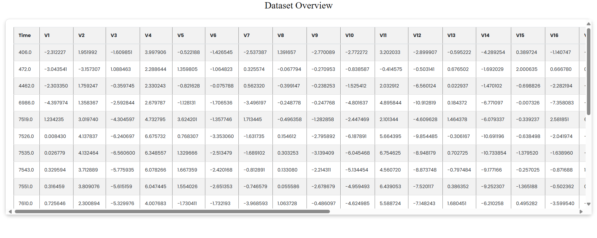

# Credit Card Fraud Detection Project

## About the Project

This project is based on the Credit Card Fraud Detection dataset from Kaggle, which can be found [here](https://www.kaggle.com/datasets/mlg-ulb/creditcardfraud). The dataset contains transactions made by European cardholders during September 2013, with a total of 284,807 transactions and 492 fraudulent transactions, making this a highly imbalanced dataset.

### Understanding the Dataset

The dataset consists of 31 columns, including features and a target variable. The features (V1 to V28) are the result of a Principal Component Analysis (PCA) to protect sensitive information. Here are the key variables:

- **V1 to V28:** These are the principal components obtained from applying PCA on the original transaction data. The actual features used for these transformations are not disclosed for privacy reasons.
- **Time:** This field contains the time elapsed between this transaction and the first transaction in the dataset, measured in seconds. It helps capture trends over time.
- **Amount:** The transaction amount for each record. This variable can be useful for detecting anomalies in fraudulent transactions.
- **Class:** This is the target variable that indicates whether a transaction is fraudulent. A value of 1 represents fraud, while 0 represents a legitimate transaction.

Since the dataset is highly imbalanced, with only 492 fraud cases out of 284,807 total transactions, special techniques such as SMOTE (Synthetic Minority Over-sampling Technique) were used to handle this imbalance during the training phase.

### Screenshots

#### Register

#### Login

#### Home Page

#### Profile

#### Dashboard

#### About

#### Contact

#### Transaction

#### Dataset Overview

#### Graphs

